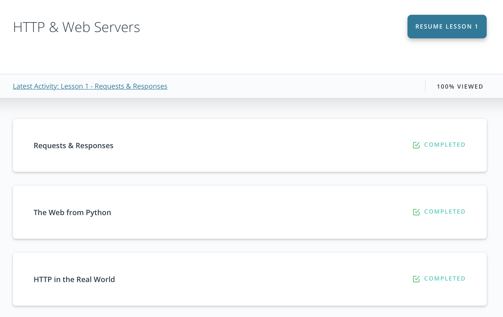

# Quantori python homework

[Homework 0](hw0.md)
1. Поставить Python 3 (https://www.python.org/downloads/).
2. Выбрать редактор/IDE и установить (PyCharm, Sublime Text, Atom, Notepad++ - что хотите).
3. Поставить себе git (https://git-scm.com/downloads).
4. Создать открытый для всех (или только меня) репозиторий.
---

[Homework 1](hw1.py)
1. Составить таблицу соответствия между различными объектами основных классов: int, str и объектами класса bool.
2. Разобраться с различиями между input() и raw_input(). Также в контексте разных версий python: 2 и 3.
3. Найти и прочитать PEP про изменение print между python2 и python3.
---

[Homework 2](hw2.py)

Встроенная функция input позволяет ожидать и возвращать данные из стандартного
ввода в виде строк (весь введенный пользователем текст до нажатия им enter).
Используя данную функцию, напишите программу, которая:

1. После запуска предлагает пользователю ввести текст, содержащий любые слова,
слоги, числа или их комбинации, разделенные пробелом.
2. Считывает строку с текстом, и разбивает его на элементы списка, считая
пробел символом разделителя.
3. Печатает этот же список элементов (через пробел), однако с удаленными
дубликатами.

Пример:
```
-> asdfdsf324 ?3 efref4r4 23r(*&^*& efref4r4 a a bb ?3
asdfdsf324 ?3 efref4r4 23r(*&^*& a bb
```
---

[Homework 3](hw3.py)

Встроенная функция input позволяет ожидать и возвращать данные из стандартного
ввода в виде строки (весь введенный пользователем текст до нажатия им enter).
Используя данную функцию, напишите программу, которая:

1. После запуска предлагает пользователю ввести текст.
2. В качестве ответа печатает наиболее часто встречающееся в тексте слово
или несколько таких слов, если имеет место "ничья". Также указывая
сколько именно раз слово встретилось в тексте. (Игнорируйте заглавные буквы
при отождествлении слов - то есть считайте слова "Подлодка" и "подлодка"
одинаковыми, а разные формы слов - разными словами)
После чего ждет следующего ввода.

Пример:
```
-> собака кот кошка Собака
2 - собака
-> собака кот кошка Собака кот
2 - собака
2 - кот
```
---

[Homework 4](hw4.py)

Встроенная функция input позволяет ожидать и возвращать данные из стандартного
ввода ввиде строк (весь введенный пользователем текст до нажатия им enter).
Используя данную функцию, напишите программу, которая:

1. После запуска предлагает пользователю ввести целые неотрицательные числа,
разделенные любым не цифровым литералом (пробел, запятая, %, буква и т.д.).
2. Получив вводные данные, выделяет полученные числа, суммирует их,
и печатает полученную сумму.

Например:
```
-> 12 12 12
36
-> 123dfgdr%0&45ty-45--900
-777
```
---

[Homework 5](hw5.py)

Встроенная функция input позволяет ожидать и возвращать данные из стандартного
ввода ввиде строки (весь введенный пользователем текст до нажатия им enter).
Используя данную функцию, напишите программу, которая:

1. После запуска предлагает пользователю ввести неотрицательные целые числа,
разделенные через пробел и ожидает ввода от пользователя.
2. Находит наименьшее положительное число, не входящее в данный пользователем
список чисел и печатает его.


Например:
```
-> 2 1 8 4 2 3 5 7 10 18 82 2
6
```
---

[Homework 6](hw6.py)

https://projecteuler.net/problem=36

The decimal number, 585 = 1001001001 in binary, is palindromic in both bases.
Find the sum of all numbers, less than one million, which are palindromic in
base 10 and base 2. (Please note that the palindromic number,
in either base, may not include leading zeros.)

Напишите программу, которая решает описанную выше задачу и печатает ответ.

---

[Homework 7](hw7.py)

Напишите программу, которая читает данные из файлов
/etc/passwd и /etc/group на вашей системе и выводит
следующую информацию в файл output.txt:
1. Количество пользователей, использующих все имеющиеся
интерпретаторы-оболочки.
`( /bin/bash - 8 ; /bin/false - 11 ; ... )`
2. Для всех групп в системе - UIDы пользователей
состоящих в этих группах.
`( root:1, sudo:1001,1002,1003, ...)`
   
---

[Homework 8](hw8.py)

Встроенная функция input позволяет ожидать и возвращать данные из стандартного
ввода в виде строки (весь введенный пользователем текст до нажатия им enter).
Используя данную функцию, напишите программу, которая:

1. После запуска предлагает пользователю ввести текст.
2. Проверяет и, если возможно, преобразовывает полученный текст в число,
используя рекурсивную функцию.
Если число четное - делит его на 2 и выводит результат.
Если число нечетное - умножает на 3 и прибавляет 1.
После чего ждет следующего ввода.
3.При получении в качестве вводных данных 'cancel' завершает свою работу.

Пример:

```
-> Привет123
Не удалось преобразовать введенный текст в число.
-> 2
1
-> 3
10
-> Два
Не удалось преобразовать введенный текст в число.
-> cancel
Bye!
```
---

[Homework 9](hw9.py)

Решить несколько задач из projecteuler.net

Решения должны быть максимально лаконичными, и использовать list comprehensions.

```
problem9 - list comprehension : one line
problem6 - list comprehension : one line
problem40 - list comprehension
problem48 - list comprehension : one line
```

---

[Homework 10](hw10.py)

Гипотеза Коллатца
может быть кратко выражена следующим образом:

берём любое натуральное число n, если оно чётное,
то делим его на 2 если нечётное, то умножаем на 3
и прибавляем 1 (получаем 3n + 1) над полученным
числом выполняем те же самые действия, и так далее.

Гипотеза Коллатца заключается в том, что какое бы
начальное число n мы ни взяли, рано или поздно мы
получим единицу.

Пример
```
Для числа 12:
12
6
3
10
5
16
8
4
2
1
```
Всего получаем 9 шагов.

Задача
Вычислить число шагов для числа n, согласно гипотезе
Коллатца необходимых для достижения этим числом единицы.

---

[Homework 11](hw11.py)

Напишите функцию letters_range, которая ведет себя
похожим на range образом, однако в качестве start и
stop принимает не числа, а буквы латинского алфавита
(в качестве step принимает целое число) и возращает
не перечисление чисел, а список букв, начиная с
указанной в качестве start, до указанной в качестве
stop с шагом step (по умолчанию равным 1).

Пример:
```
>>letters_range('b', 'w', 2)
['b', 'd', 'f', 'h', 'j', 'l', 'n', 'p', 'r', 't', 'v']

>>letters_range('a', 'g')
['a', 'b', 'c', 'd', 'e', 'f']

>>letters_range('g', 'p')
['g', 'h', 'i', 'j', 'k', 'l', 'm', 'n', 'o']

>>letters_range('p', 'g', -2)
['p', 'n', 'l', 'j', 'h']

>>letters_range('a','a')
[]
```
---

[Homework 12](hw12.py)

Написать функцию Фиббоначи fib(n), которая вычисляет
элементы последовательности Фиббоначи:
1 1 2 3 5 8 13 21 34 55 .......

---

[Homework 13](hw13.py)

Напишите функцию, которая переводит значения показаний
температуры из Цельсия в Фаренгейт и наоборот.

---

[Homework 14](hw14.py)

Создать сотрудника Mary, пользуясь классом
Employee и перенести его в другую программу,
используя модуль Pickle и файловую систему.
Узнать про + и - модуля Pickle.

нужен отчет по работе.

---

[Homework 15](hw15.py)

Написать класс router.
Должен иметь методы добавить/удалить/вывести список ip address.
Должен иметь методы добавить/удалить/вывести список ip routes.

Есть маршруты к непосредственно-подключенным сетям:
если у устройства есть ip-address 192.168.5.14/24 на интерфейсе eth1,
значит у него должен быть маршрут:
к сети 192.168.5.0/24 через eth1 или через 192.168.5.14.

Если мы хотим добавить маршрут к какой-нибудь удаленной сети,
то надо проверять доступен ли gateway.

Например мы можем добавить маршрут к 172.16.0.0/16 через gateway
192.168.5.132, только если у нас уже есть маршрут до 192.168.5.132.

Если же мы попытаемся добавить маршрут до какой-либо сети через gateway,
до которого у нас пока еще нет маршрута, то должен вылетать exception.

Например:
Добавляем ip-address 192.168.5.14/24 eth1.
Добавляем маршрут до 172.16.0.0/16 через 192.168.5.1 - ok.
Добавляем маршрут до 172.24.0.0/16 через 192.168.8.1 - exception.
Добавляем маршрут до 172.24.0.0/16 через 172.16.8.1 - ok.

Итого - 1 интерфейс и 3 маршрута в таблице.

docstrings, комментарии, демонстрации и прочий код необходим для проверки качества класса.

---

[Homework 16](hw16.py)

Написать программу, которая будет считывать из файла gps координаты,
и формировать текстовое описание объекта и ссылку на google maps.
Пример:

```
Input data: 60,01';30,19'
Output data:
Location: Теремок, Енотаевская улица, Удельная, округ Светлановское, Выборгский район, Санкт-Петербург, Северо-Западный федеральный округ, 194017, РФ
Goggle Maps URL: https://www.google.com/maps/search/?api=1&query=60.016666666666666,30.322
```
---

[Homework 17](hw17.py)

Написать скрипт, который будет вытаскивать gps данные
из фотографии (jpg файл) и передавать их на вход программе
из hw16

---

[Homework 18](hw18.py)

Написать скрипт, который будет создавать миниатюры фотографий.
Объем полученого файла должен передаваться как параметр.
---

Homework 19

Пройти курс на [udacity](https://classroom.udacity.com/courses/ud303)



---

[Homework 20](hw20.py)


---

[Homework 21](hw21.py)


---

Homework 22

Пройти курс на [udacity](https://classroom.udacity.com/courses/ud388)
